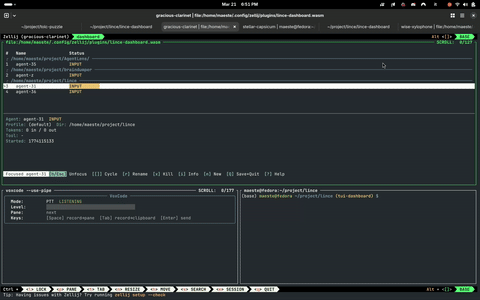

# LINCE

**Linux Intelligent Native Coding Environment**

A toolkit that turns your Linux terminal into a complete agentic engineering workstation — sandboxed AI agent, task board, and voice control, all wired together in a single multiplexer session.

## Demo



> The full workflow: voice command → Whisper transcription → Claude Code executes in sandbox → backlog updates — all from one terminal.

## The Setup

No Electron wrappers, no IDE overhead — just a terminal multiplexer, a sandboxed AI agent, a task board, and your voice. Three panes, three tools, one workflow.

```
┌─────────────────────────────────────────┐
│                                         │
│   Claude Code (sandboxed)               │
│   Full autonomy, zero risk to your      │
│   host machine. Speaks, codes, builds.  │
│                                         │
├───────────────────┬─────────────────────┤
│                   │                     │
│   Backlog.md      │   VoxCode           │
│   Task board      │   Voice input       │
│   right here      │   Talk to Claude    │
│                   │                     │
└───────────────────┴─────────────────────┘

VoxTTS completes the voice loop — read Claude's output or any text aloud:

    voxtts --pane --play        # read pane content through speakers
    voxtts notes.md -o notes.mp3  # convert markdown to audio file
```

This is what it looks like when you run `z3` (a shell alias) — Zellij opens a three-pane layout where everything is connected:

1. **Top pane**: Claude Code runs inside a [bubblewrap](https://github.com/containers/bubblewrap) sandbox with `--dangerously-skip-permissions`. Full agent autonomy — file edits, shell commands, package installs — all confined to your project directory. Your SSH keys, cloud credentials, and host filesystem stay untouched.

2. **Bottom-left pane**: [Backlog.md](https://backlog.md) board — a markdown-native task manager that lives in your repo and integrates with Claude via MCP. Your tasks, priorities, and progress are visible at a glance without leaving the terminal.

3. **Bottom-right pane**: VoxCode — a voice coding assistant. Speak into your microphone, get local Whisper transcription, and the text lands in the Claude Code pane above. Hands-free prompting.

The result: you look at the task board, dictate what to do next, and Claude does it — sandboxed, tracked, and entirely from your terminal.

## Modules

### [sandbox/](sandbox/)

Bubblewrap-based sandbox for running Claude Code with `--dangerously-skip-permissions` safely. Restricts filesystem access, blocks git push, isolates environment variables, and hides host processes — with near-zero overhead.

### [zellij-setup/](zellij-setup/)

Custom [Zellij](https://zellij.dev) configuration with predefined three-pane layouts for the workflow described above. Includes keybindings, Dracula theme, shell aliases, and an interactive installer. Multiple layouts support different provider profiles (Vertex AI, direct API, etc.).

### [voxcode/](voxcode/)

Voice-controlled coding assistant that bridges local speech recognition (Whisper, runs on your GPU) with Claude Code via terminal multiplexer panes. All audio processing happens locally — nothing leaves your machine.

### [voxtts/](voxtts/)

Text-to-Speech with local GPU/CPU engines. The output counterpart to VoxCode — converts text files, clipboard content, stdin pipes, or terminal pane captures into natural-sounding audio. Supports Kokoro TTS (neural, high quality) and Piper TTS (fast, CPU-optimized), with auto language detection, streaming playback, and MP3/WAV output. All synthesis runs locally on your machine.

### [lince-dashboard/](lince-dashboard/)

Multi-agent TUI dashboard — a Zellij WASM plugin (Rust) that manages multiple Claude Code instances running in hidden panes. Spawn agents, track their status (running/idle/waiting for input), show/hide panes, and relay voice input — all from a single dashboard pane. Agents run inside [claude-sandbox](sandbox/) for isolation.

### [agent-ready-skill/](agent-ready-skill/)

[Agent Skills](https://agentskills.io) that assess a project's readiness for agentic coding. Scans 8 dimensions (instructions, navigability, testing, CI/CD, specs, skills, docs, Claude-specific tooling), produces a 0-100 score, and can auto-generate missing files to improve readiness. Works with Claude Code via symlinks into `.claude/skills/`.

## Putting It All Together

### Prerequisites

- **Linux** (tested on Fedora 43, works on Ubuntu/Debian/Arch)
- **Zellij** (installed by `zellij-setup/install.sh`)
- **Claude Code** (`npm install -g @anthropic-ai/claude-code`)
- **bubblewrap** (`sudo dnf install bubblewrap` / `sudo apt install bubblewrap`)
- **A microphone** and an **NVIDIA GPU** (for VoxCode/VoxTTS; CPU-only works but is slower)
- **[uv](https://github.com/astral-sh/uv)** (for VoxCode and VoxTTS Python environments)

### Step 1: Set up the sandbox

```bash
cd sandbox
cp claude-sandbox ~/.local/bin/
claude-sandbox init
```

This creates an isolated environment where Claude has full write access to your project but physically cannot reach your SSH keys, cloud credentials, or anything outside the project directory. See [sandbox/README.md](sandbox/README.md) for the full configuration reference.

### Step 2: Install Zellij and the layouts

```bash
cd zellij-setup
chmod +x install.sh
./install.sh
```

The installer copies layouts, keybindings, and shell aliases. After sourcing your shell config (`source ~/.bashrc`), you get:

| Alias | Layout |
|-------|--------|
| `z3` | Three-pane with default provider profile |
| `zz3` | Three-pane with Z.ai (Vertex AI) profile |

### Step 3: Install Backlog.md

[Backlog.md](https://github.com/backlog-md/backlog) is a markdown-native task manager designed for terminal workflows. Tasks are plain markdown files in your repo, and it comes with an MCP server that lets Claude read and manage your backlog directly.

Install it following the [Backlog.md documentation](https://github.com/backlog-md/backlog), then run `backlog board` in any project with a `backlog/` directory. The Zellij layout starts it automatically in the bottom-left pane.

When Claude has the Backlog.md MCP server configured, it can create tasks, update progress, and check what's next — all from within the sandboxed session.

### Step 4: Set up VoxCode

```bash
cd voxcode
uv sync                  # installs Python + dependencies
```

Find your microphone device number:

```bash
uv run voxcode --list-devices
```

Test that transcription works (speak into your mic when prompted):

```bash
uv run voxcode --audio-device <number>
```

See [voxcode/README.md](voxcode/README.md) for model options, PTT mode, and configuration details.

### Step 5: Set up VoxTTS (optional)

```bash
cd voxtts
uv sync
```

Test that TTS works:

```bash
echo "Hello world" | uv run voxtts --play --device cpu
```

The first run downloads the Kokoro model (~300 MB). See [voxtts/README.md](voxtts/README.md) for engine options, voices, and configuration.

### Step 6: Launch everything

```bash
z3    # opens Zellij with the three-pane layout
```

The top pane starts Claude Code inside the sandbox. The bottom-left starts `backlog board`. The bottom-right pane opens a shell — start VoxCode there:

```bash
cd /path/to/voxcode
uv run voxcode --audio-device <number>
```

VoxCode auto-detects that it's running inside Zellij and finds the Claude Code pane automatically. Speak, review the transcription in the VoxCode pane, and say **"comando: invia"** (or press Enter) to send the text to Claude.

That's it. You're talking to a sandboxed AI agent that manages its own task board, all from your terminal.

### The Workflow in Practice

```
You (speaking):  "Pick up the next task from the backlog and start working on it"
                        │
                        ▼
VoxCode:         Whisper transcribes locally → text appears in buffer
                        │
                        ▼
You:             "comando: invia"  (or press Enter)
                        │
                        ▼
Claude Code:     Reads the backlog via MCP → picks a task →
                 marks it in-progress → writes code → runs tests →
                 updates the task board → asks you what's next
                        │
                        ▼
Backlog.md:      Board updates in real-time in the bottom-left pane
```

No mouse. No browser. No context switching. Just your voice, your terminal, and an agent that does the work.

## License

MIT
